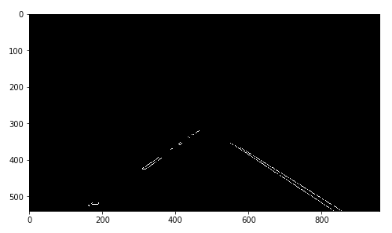

# **Finding Lane Lines on the Road**

---

**Finding Lane Lines on the Road**

The goals / steps of this project are the following:
* Make a pipeline that finds lane lines on the road
* Reflect on your work in a written report

[//]: # (Image References)

[image1]: ./examples/grayscale.jpg "Grayscale"

---

### Reflection

### 1. Describe your pipeline. As part of the description, explain how you modified the draw_lines() function.

#### Version I
My pipeline consisted of 5 steps. First, I converted the images to grayscale. Then a gaussian blur was added to smooth the image. Then the canny transformation was used to create the edge-based image. To simplify the problem a Region of Interest(ROI) is defined to focus on the scene of road. Given the ROI, a mask image was build for the following processing. Then Hough transformation was used to detect the lines in the mask image. Parameters of hough transformation was tuned to fit the real lane lines.
At last the line detected image was added on top of the original image to visualise the lane line detection in real time.

Some key stage of the processing are listed as follows:

Grayscale image:

Edged detected image (The output of canny transformation with ROI mask added):

Line detected image (Hough transformation):

Image overlay:

#### Version II
The purpose of the Version II was to improve the performance and to represent the lane lines in two single lines.

Given the test results of Version I method, several changes had been made:
1. The code was designed base on OOP, to make it easy for the further maintenance and improvements
2. The original RGB image was converted to HSV image which can define the colour in a much clear way. By pre-defining the colour space(yellow and white) of the lane line, a mask image was created.
3. Linear regression was used to fit to a single line based on the outputs(line segments) of hough transformation.
4. To stabilise the detected line, a buffer with average filter was added.
5. Some pre-defined rules were also added as extra filter for the outputs of hough transformation. Those rules are:
  1. The detected lines cannot be horizontal and should have a reasonable slope.
  2. The difference between lane line's slope and this detected lines' cannot be too much.
  3. The detected line should not be far away from the real lane lines.
  4. The detected line should be below the estimated cross point of the lane lines.

The output of Version II shows as follow:

### 2. Identify potential shortcomings with your current pipeline

1. The result of linear regression is not being evaluated. Some of outliers has too much influence to the final results.
2. The effect of the illumination of the image needs to be tested.
3. The algorithm may not handle sharp turning very well.

### 3. Suggest possible improvements to your pipeline

A possible improvement would be to add evaluation function for the result of linear regression.

Define self-adapted filters for dealing with different illumination.

Improve the algorithm speed for reaching better real-time performance.

May consider to use 2nd or 3rd order polynomial to fit the lane line.

A self-adapted ROI is also nice to have.
